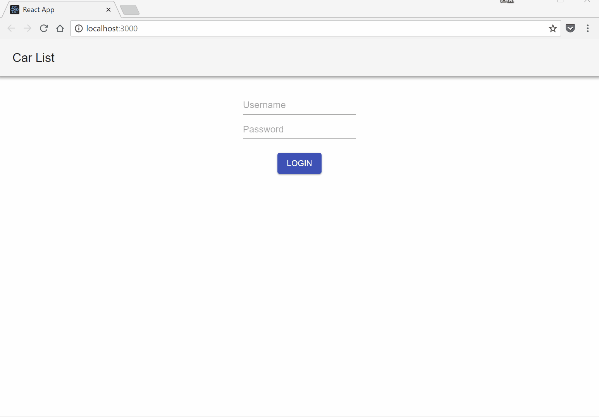
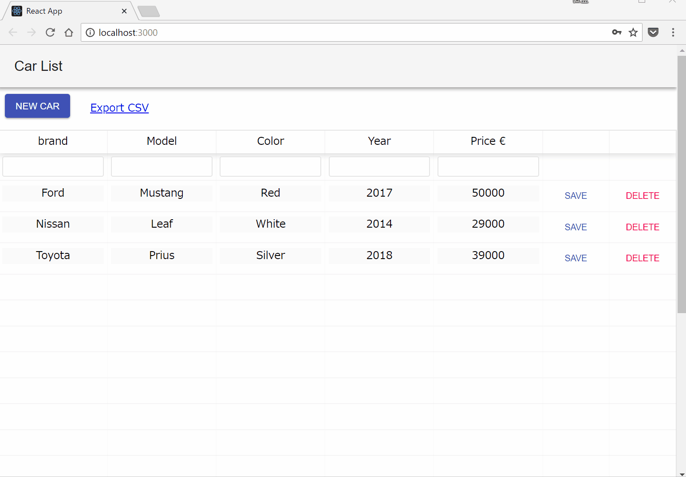
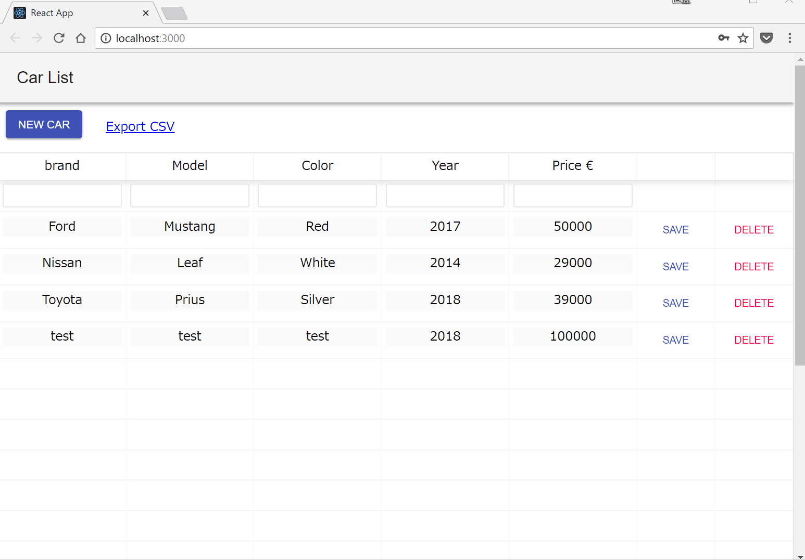

# spring-boot2-react-material-ui-carlist-app

This is the code repository for [Hands-On Full Stack Development with Spring Boot 2.0 and React](https://www.packtpub.com/application-development/hands-full-stack-development-spring-boot-20-and-react?utm_source=github&utm_medium=repository&utm_campaign=9781789138085)

**Build modern and scalable full stack application using the Java-based Spring boot 2 (Server side) and React (Client side)**

This repository was modified from the original source code [Hands-On Full Stack Development with Spring Boot 2.0 and React](https://github.com/PacktPublishing/Hands-On-Full-Stack-Development-with-Spring-Boot-2.0-and-React) for bug fixes.

## Get Started

### 1. Run MariaDB using Docker container (port:3307)

```bash
docker run -it --rm --name mariadb -e MYSQL_DATABASE=cardb_test -e MYSQL_ROOT_PASSWORD=password -p 3307:3306 -d mariadb:10.3.9
```

### 2. Run Backend server (Spring Boot, port:8090)

```bash
# For MacOS, Linux
./mvnw spring-boot:run

# For Windows
mvnw.cmd spring-boot:run
```

### 3. Run Frontend server (Nodejs + React, port:3000)

```bash
# Install all the dependencies listed within `package.json`
yarn install

# Startup React app
yarn start
```

## Login



## Add a new car



## Update a new car info


## Delete a new car


